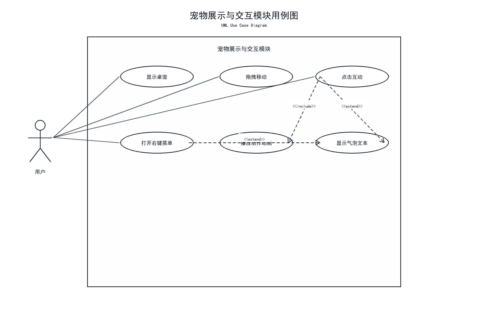
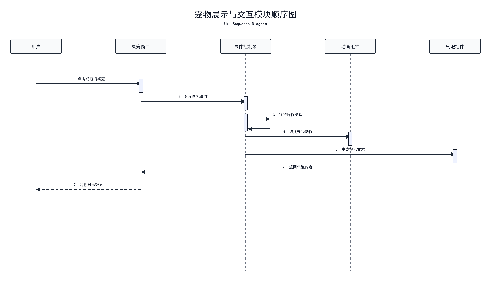

# 桌宠形象与桌面交互模块

## 模块作用

该模块是北极熊桌面宠物系统的核心展示模块，主要负责桌宠在桌面上的显示、移动和基础互动。用户打开应用后，首先看到的就是悬浮在桌面上的北极熊桌宠，因此该模块直接影响系统的第一印象和交互体验。

## 主要功能

- 北极熊桌宠形象显示
- 桌宠窗口置顶显示
- 鼠标拖拽移动
- 双击互动反馈
- 呼吸动画
- 后续扩展待机、点击、睡眠、投喂等动作

## 中期已完成

- 已创建 PySide6 悬浮桌宠窗口
- 已接入半扁平、生动的北极熊 PNG 素材
- 已实现桌宠窗口置顶
- 已实现鼠标拖拽移动
- 已实现呼吸动画
- 已实现双击互动反馈

## 后续计划

- 增加更多动作素材
- 实现点击、睡眠、投喂等动作切换
- 增加右键菜单
- 优化窗口透明、缩放和吸附效果
- 后续可扩展为序列帧动画或骨骼动画

## 对应用例图

使用 Word 文档中的 **图 3 宠物展示与交互模块用例图**。



文档位置：

```text
E:\virtualpet-main\docs\桌面宠物系统UML设计图_讲解注释版.docx
```

## 用例图讲解注释

图 3 对应桌宠形象与桌面交互模块，重点体现用户查看北极熊桌宠、拖拽移动、点击互动和触发动作反馈等功能。该模块是系统最直观的入口，用户打开应用后首先接触到的就是桌宠本体，因此该图主要说明用户如何与桌面上的北极熊进行直接交互。

## 对应顺序图

使用 Word 文档中的 **图 4 宠物展示与交互模块顺序图**。



## 顺序图讲解注释

图 4 描述用户与桌宠交互的执行过程。用户操作桌宠后，桌宠窗口接收鼠标事件，再调用动作控制逻辑，更新桌宠显示效果，并将互动事件写入通知日志模块。答辩时可以用这张图说明桌宠从“接收用户操作”到“产生动画反馈”的完整流程。

## 答辩讲法

这个模块主要负责北极熊桌宠的形象展示和桌面交互，是整个系统最直观的部分。中期阶段我已经完成了悬浮桌宠窗口原型，桌宠可以置顶显示、拖拽移动，并具有呼吸动画和双击互动反馈。后续会继续完善更多动作和桌面交互效果。
