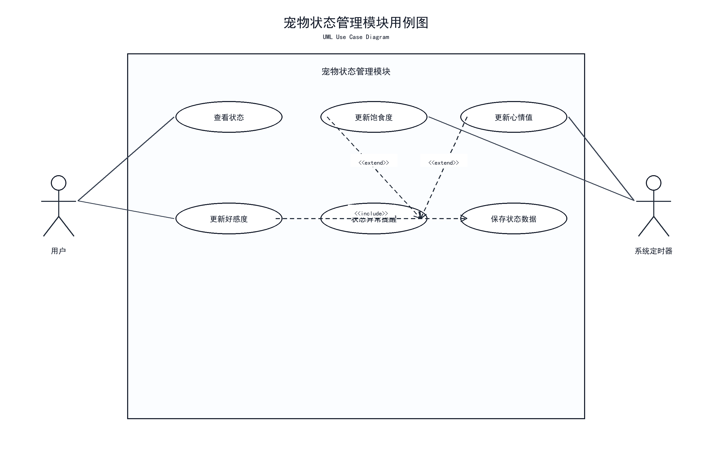
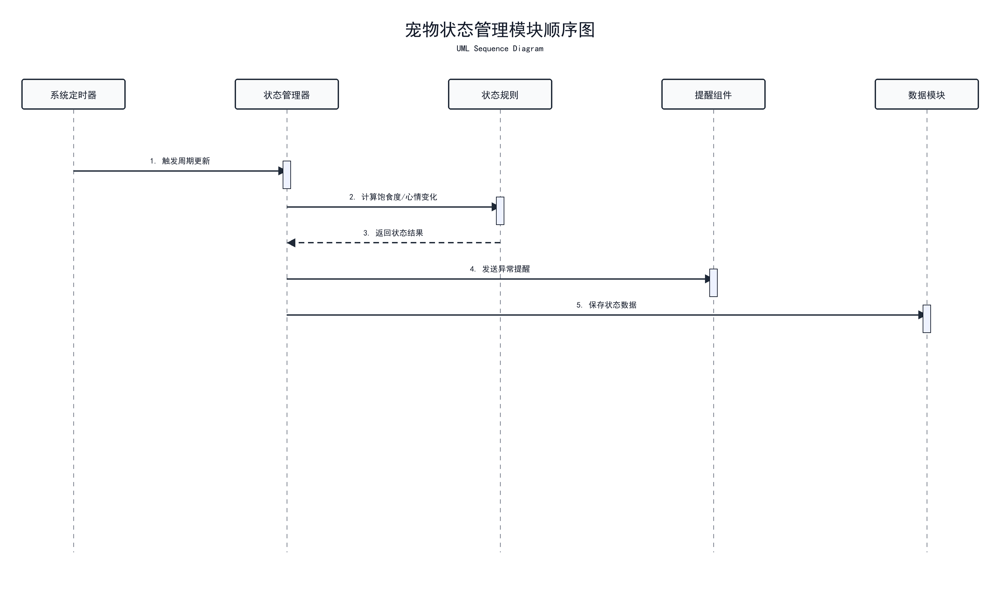
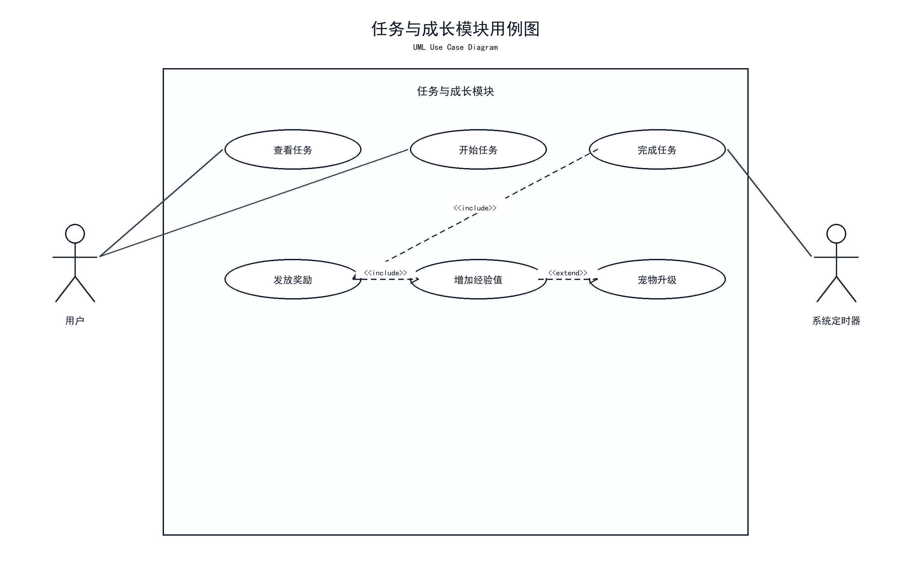
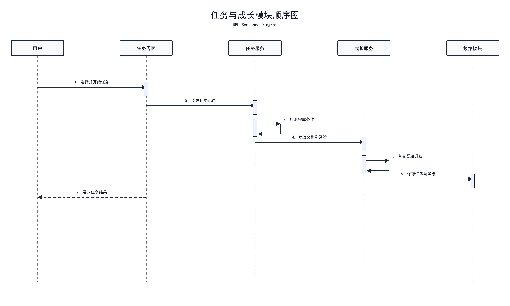

# 宠物状态与成长任务模块

## 模块作用

该模块负责桌宠的养成属性和成长任务，是系统玩法性的主要来源。通过状态值和任务机制，用户可以感受到桌宠不是一个单纯的图片窗口，而是具有成长过程和陪伴反馈的桌面宠物。

## 主要功能

- 饱食度管理
- 心情值管理
- 好感度管理
- 成长值与等级经验
- 每日任务
- 专注任务
- 任务完成奖励

## 中期已完成

- 已完成状态指标设计
- 已确定主要状态包括饱食度、心情值、好感度和成长值
- 已完成成长任务模块页面原型
- 已设计每日陪伴、投喂、互动、专注等任务类型
- 已在中期方案中明确状态与任务之间的联动关系

## 后续计划

- 实现状态随时间变化
- 实现投喂后提升饱食度和心情值
- 实现普通互动提升心情、完整关怀与专注逐步提升好感度
- 实现任务完成后增加经验
- 实现等级提升和成长奖励
- 将状态数据写入本地存档

## 对应用例图

使用 Word 文档中的 **图 5 宠物状态管理模块用例图**。



文档位置：

```text
E:\virtualpet-main\docs\桌面宠物系统UML设计图_讲解注释版.docx
```

## 用例图讲解注释

图 5 对应宠物状态管理模块，主要体现用户查看饱食度、心情值、好感度、成长值等状态，以及系统根据互动、投喂和时间变化更新宠物状态。该图说明桌宠不是静态形象，而是具备可变化的养成属性。

## 对应顺序图

使用 Word 文档中的 **图 6 宠物状态管理模块顺序图**。



## 顺序图讲解注释

图 6 展示状态更新流程。用户触发互动、投喂或任务操作后，状态管理模块根据规则计算属性变化，再同步到界面显示和本地存档中。答辩时可以说明该图体现了宠物状态从“触发事件”到“计算变化”再到“保存显示”的过程。

## 任务与成长补充图

由于本模块同时包含成长任务设计，因此还可以结合 Word 文档中的 **图 9 任务与成长模块用例图** 和 **图 10 任务与成长模块顺序图** 一起讲解。





补充讲解：图 9 和图 10 主要说明任务查看、任务执行、任务完成和成长奖励的过程。答辩时可以说明，状态管理解决“宠物当前状态是什么”，任务成长解决“用户如何通过任务推动宠物成长”。

## 答辩讲法

这个模块主要负责桌宠的状态养成和任务成长。中期阶段我已经完成了状态指标和任务类型的设计，并建立了对应的页面原型。后续会实现状态随时间变化、投喂影响属性、任务完成增加经验等功能，让桌宠具备更完整的养成体验。
