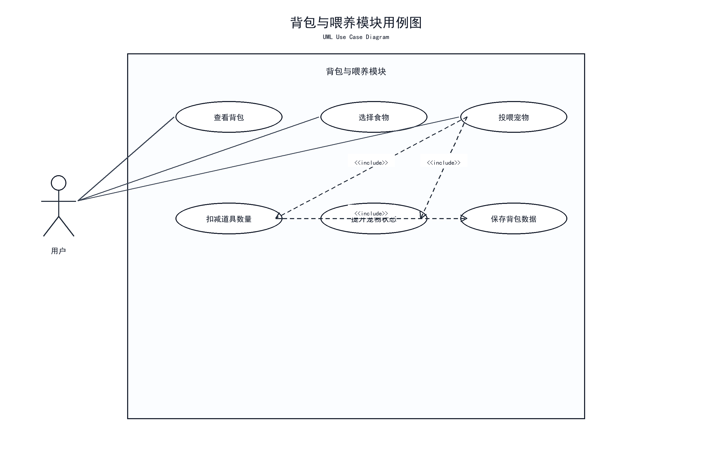
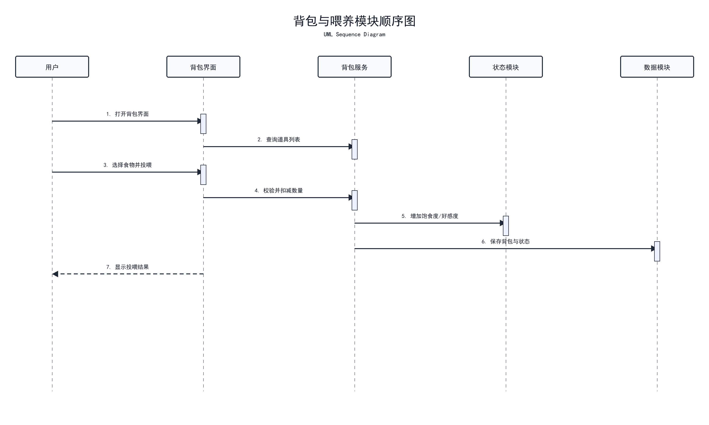

# 背包、商店与喂养模块

## 模块作用

该模块负责物品管理、商店购买和桌宠喂养功能。它与宠物状态模块密切相关，用户通过投喂食物或使用道具，可以影响北极熊桌宠的饱食度、心情值和好感度。

## 主要功能

- 背包物品展示
- 食物道具管理
- 商店购买
- 投喂操作
- 物品数量变化
- 投喂后状态变化
- 金币或奖励机制

## 中期已完成

- 已完成背包与喂养模块设计
- 已建立背包喂养模块页面原型
- 已规划北极熊主题物品
- 已明确投喂行为与宠物状态之间的关系
- 已将该模块纳入 UML 用例和顺序流程中

## 示例物品设计

- 极地鱼干：提升饱食度
- 蓝莓蛋糕：提升心情值
- 热牛奶：提升好感度
- 冰雪铃铛：触发互动反馈

## 后续计划

- 实现背包数据结构
- 实现物品数量增减
- 实现商店购买逻辑
- 实现金币消耗和奖励
- 实现投喂后状态变化
- 实现投喂动作和气泡反馈

## 对应用例图

使用 Word 文档中的 **图 7 背包与喂养模块用例图**。



文档位置：

```text
E:\virtualpet-main\docs\桌面宠物系统UML设计图_讲解注释版.docx
```

## 用例图讲解注释

图 7 对应背包与喂养模块，体现用户查看背包、选择食物、投喂桌宠和管理物品数量等功能。该模块与宠物状态模块存在直接联动，因为投喂行为会影响饱食度、心情值或好感度。

## 对应顺序图

使用 Word 文档中的 **图 8 背包与喂养模块顺序图**。



## 顺序图讲解注释

图 8 展示投喂流程。用户选择物品后，背包模块扣减物品数量，桌宠模块播放投喂反馈，状态模块更新饱食度或好感度，日志模块记录本次操作。答辩时可以用该图说明背包、桌宠显示、状态管理和日志记录之间的协作关系。

## 答辩讲法

这个模块主要负责背包、商店和投喂功能。用户可以通过物品与桌宠进行互动，例如投喂食物提升饱食度或好感度。中期阶段我已经完成了模块设计和页面原型，并规划了北极熊主题物品。后续会实现具体的物品数量、购买和投喂联动逻辑。
