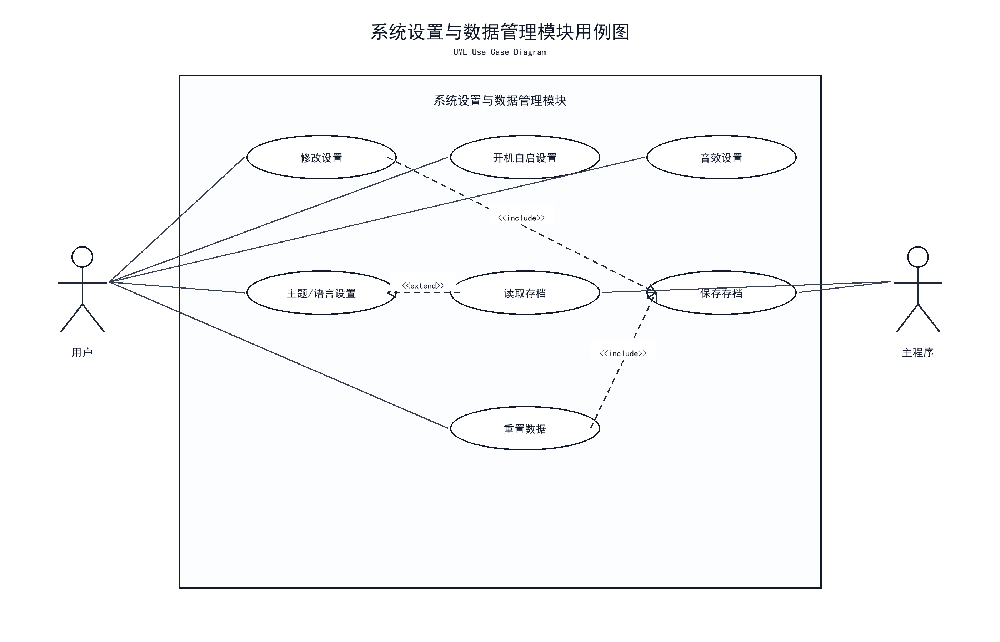
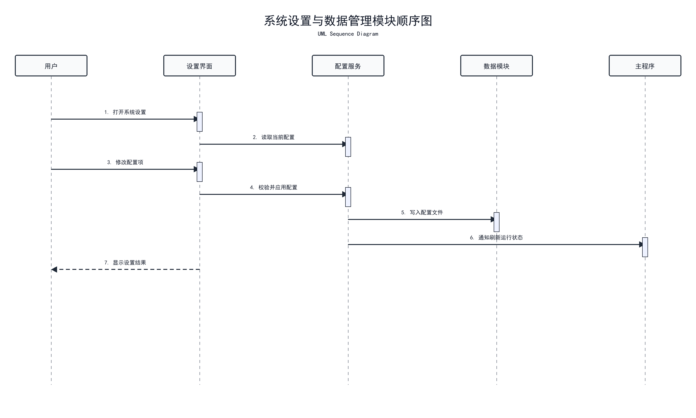

# 系统设置与存档管理模块

## 模块作用

该模块负责应用的基础配置和数据保存。桌面宠物应用需要长期运行，因此用户的设置、宠物状态、背包数据和任务进度都需要能够保存和恢复。

## 主要功能

- 桌宠置顶设置
- 窗口大小设置
- 透明度设置
- 声音开关
- 开机自启
- 主题风格
- 本地存档
- 数据读取与恢复

## 中期已完成

- 已完成系统设置模块设计
- 已建立系统设置页面原型
- 已明确需要保存的数据内容
- 已确定后续采用本地文件保存数据
- 已在中期方案中规划设置和存档功能

## 存档内容设计

- 宠物状态数据
- 背包物品数据
- 任务完成进度
- 用户设置
- 桌宠窗口位置
- 桌宠主题配置

## 后续计划

- 实现 JSON 本地存档
- 实现设置读取和写入
- 实现窗口位置保存
- 实现状态和背包数据保存
- 实现应用启动时自动恢复数据
- 后续考虑开机自启和托盘菜单

## 对应用例图

使用 Word 文档中的 **图 11 系统设置与数据管理模块用例图**。



文档位置：

```text
E:\virtualpet-main\docs\桌面宠物系统UML设计图_讲解注释版.docx
```

## 用例图讲解注释

图 11 对应系统设置与数据管理模块，体现用户修改置顶、缩放、声音、主题、开机自启，以及保存和读取本地数据等功能。该图说明桌宠应用不仅要能运行，还要能保存用户偏好和宠物数据。

## 对应顺序图

使用 Word 文档中的 **图 12 系统设置与数据管理模块顺序图**。



## 顺序图讲解注释

图 12 展示设置保存与数据恢复流程。用户修改设置后，系统写入本地配置文件；应用再次启动时读取配置和存档，恢复桌宠状态、窗口位置和用户偏好。答辩时可以说明该模块保证应用具有持续使用能力。

## 答辩讲法

这个模块主要负责系统配置和本地存档。桌宠应用不是一次性使用的软件，用户希望关闭后再次打开还能保留宠物状态和个人设置。中期阶段我已经完成了设置和存档模块的设计，后续会实现本地数据保存、窗口位置恢复和用户配置管理。
