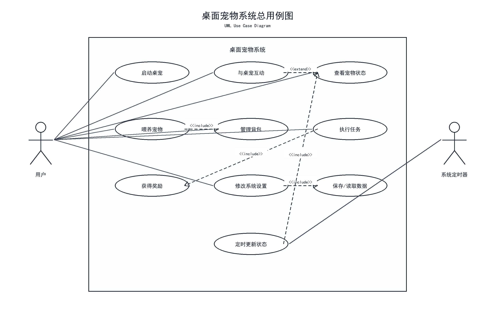
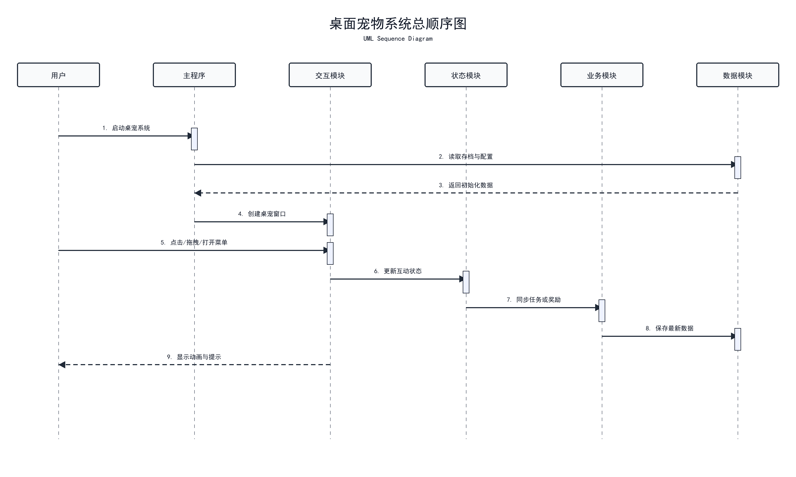

# 通知日志与智能陪伴模块

## 模块作用

该模块负责系统反馈、事件记录和后续智能陪伴功能。桌宠与用户互动时，需要通过气泡、日志或提示信息告诉用户当前发生了什么，例如投喂成功、任务完成、状态变化等。后续还会接入大语言模型，让北极熊桌宠具备自然语言对话、学习陪伴和情绪化回复能力。

## 主要功能

- 气泡提示
- 状态提醒
- 操作日志
- 成长记录
- 投喂记录
- 任务完成记录
- 应用控制台展示
- 智能聊天
- 大模型回复
- 互动日志总结

## 中期已完成

- 已完成通知日志模块设计
- 已建立通知日志模块页面原型
- 已明确桌宠气泡提示的作用
- 已明确事件日志记录内容
- 已完成 PySide6 控制台作为应用展示窗口
- 已规划后续接入大语言模型

## 日志内容设计

- 用户拖拽桌宠
- 用户点击或双击桌宠
- 用户投喂食物
- 宠物状态变化
- 任务完成
- 等级提升
- 系统设置变化

## 后续计划

- 实现气泡提示窗口
- 实现事件日志列表
- 实现通知消息队列
- 实现状态变化提醒
- 实现任务完成提示
- 后续可加入系统托盘通知
- 增加聊天窗口
- 接入云端或本地大模型
- 设计北极熊角色提示词
- 根据任务和状态生成智能提醒

## 对应用例图

该模块在当前 Word UML 文档中主要对应 **图 1 桌面宠物系统总用例图** 中的通知、日志、系统反馈相关用例。后续接入大模型后，可以在最终答辩阶段进一步扩展独立的“智能陪伴模块用例图”。



文档位置：

```text
E:\virtualpet-main\docs\桌面宠物系统UML设计图_讲解注释版.docx
```

## 用例图讲解注释

图 1 中包含用户与系统总体交互关系，其中通知日志与智能陪伴模块主要承担“反馈用户操作、记录系统事件、提示状态变化”的作用。中期阶段可以先按通知日志功能讲解，后续再说明计划接入大语言模型，实现智能聊天、学习陪伴和任务提醒。

## 对应顺序图

该模块当前主要对应 **图 2 桌面宠物系统总顺序图** 中的系统反馈、状态同步和日志记录流程。后续大模型聊天流程可作为最终扩展图补充。



## 顺序图讲解注释

图 2 展示系统总体运行流程，从用户启动应用开始，系统初始化桌宠窗口、加载状态数据、响应用户互动，并将状态变化、任务结果和日志反馈给用户。通知日志与智能陪伴模块主要位于流程后半部分，负责把系统处理结果转换为气泡、日志或后续智能回复。

## 答辩讲法

这个模块主要负责桌宠和用户之间的信息反馈。用户进行投喂、互动或完成任务后，系统需要通过气泡提示和日志记录进行反馈。后续我还计划在这个模块中接入大语言模型，让北极熊桌宠可以进行自然语言对话、学习陪伴和任务提醒。中期阶段已经完成模块设计和应用控制台展示，后续会继续完善气泡提示、事件记录和智能陪伴功能。
