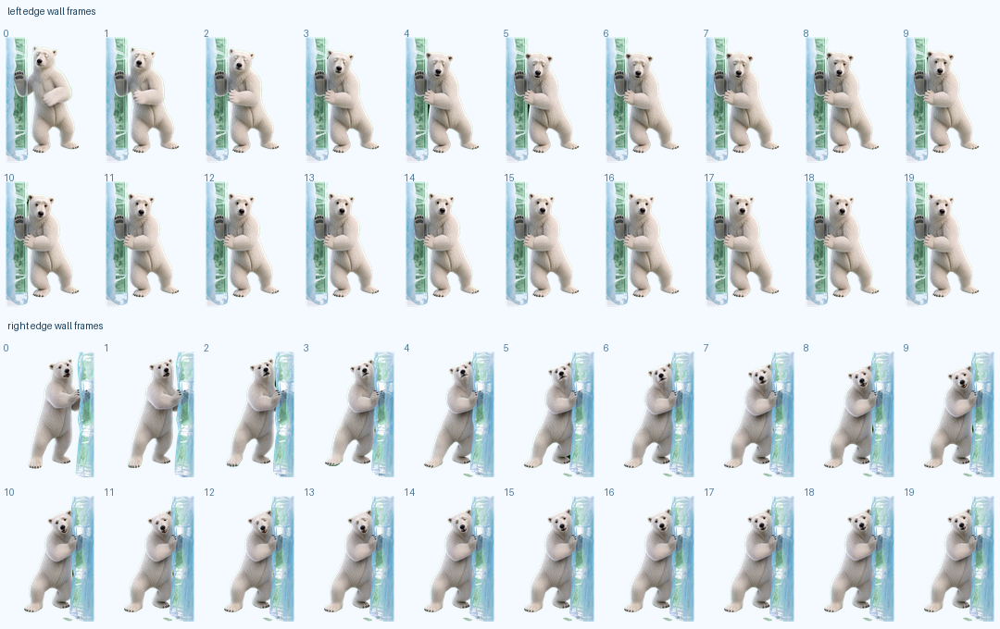

# 系统构建阶段交付材料

项目名称：北极熊桌面宠物系统  
项目路径：`polar-bear-desktop-pet`  
技术路线：Python + PySide6 + 本地 JSON 文件型数据库/本地存档

本文档用于提交“系统构建阶段”材料，覆盖以下三项要求：

1. 系统源代码、配置文件、环境要求。
2. 数据库脚本。
3. 界面截图，带简要说明。

## 一、系统源代码、配置文件、环境要求

### 1.1 源代码目录结构

项目主目录：

```text
polar-bear-desktop-pet/
├─ main.py                         应用入口，创建 QApplication 并启动主窗口
├─ src/                            系统源代码目录
│  ├─ core/
│  │  └─ app.py                    主控模块，负责控制面板、页面切换、托盘和快捷键
│  ├─ pet/
│  │  └─ window.py                 桌宠表现模块，负责透明悬浮窗口、动作帧、气泡、拖拽和贴边
│  ├─ data/
│  │  └─ store.py                  数据与成长模块，负责状态、背包、任务、课程、聊天和存档
│  ├─ features/                    功能页面模块
│  │  ├─ status.py                 宠物状态页
│  │  ├─ notification.py           课程提醒和 OCR 导入页
│  │  ├─ interaction.py            动作管理页
│  │  ├─ chat.py                   聊天互动页
│  │  ├─ backpack.py               背包商店页
│  │  ├─ growth.py                 成长等级页
│  │  └─ settings.py               系统设置页
│  ├─ services/                    外部服务模块
│  │  ├─ llm_client.py             DeepSeek、OpenAI、智谱、通义、Kimi 等大模型接口
│  │  └─ course_ocr.py             课表图片 OCR 识别和课程文本解析
│  ├─ app.py                       兼容导入入口，转发到 src.core.app
│  ├─ pet_window.py                兼容导入入口，转发到 src.pet.window
│  ├─ pet_data.py                  兼容导入入口，转发到 src.data.store
│  ├─ llm_client.py                兼容导入入口，转发到 src.services.llm_client
│  └─ course_ocr.py                兼容导入入口，转发到 src.services.course_ocr
├─ assets/                         系统资源文件
│  ├─ polar_bear/                  北极熊动作资源、角色配置和序列帧
│  └─ shop/items/                  背包商店物品图片
├─ data/                           本地运行数据和阶段截图
├─ docs/                           系统文档、设计文档、答辩材料、构建材料
├─ tools/                          动作帧处理、资源处理和辅助脚本
├─ requirements.txt                Python 依赖配置
├─ launch_polar_bear.bat           Windows 批处理启动器
├─ launch_polar_bear.vbs           Windows 静默启动脚本
└─ README.md                       项目说明和运行方式
```

说明：

- 代码已经按五大模块拆分：`core`、`pet`、`data`、`features`、`services`。
- `src/modules/` 中保留了兼容旧路径的轻量转发文件，方便旧代码或文档引用不失效。
- `__pycache__`、临时文件、运行存档和测试截图属于运行生成内容，不作为核心源代码讲解重点。

### 1.2 核心源代码清单

| 文件/目录 | 类型 | 作用 |
|---|---|---|
| `main.py` | 程序入口 | 初始化 `QApplication`，启动 `PolarBearPetApp`。 |
| `src/core/app.py` | 主控代码 | 创建控制面板、桌宠窗口、数据中心、系统托盘、快捷键和页面导航。 |
| `src/pet/window.py` | 桌宠窗口代码 | 加载真实 PNG 序列帧，绘制北极熊，处理动作、气泡、拖拽、贴边和圆点待机。 |
| `src/data/store.py` | 数据中心代码 | 管理状态、等级、好感、金币、背包、任务、课程、聊天记录和本地存档。 |
| `src/features/` | 页面代码 | 控制面板的状态、课程、动作、聊天、背包、成长、设置页面。 |
| `src/services/llm_client.py` | 服务代码 | 封装大模型 API 配置、请求和宠物人格提示词。 |
| `src/services/course_ocr.py` | 服务代码 | 封装课表图片识别、图片预处理、OCR 兜底和课程解析。 |
| `assets/polar_bear/role/PolarBear/` | 动作资源 | 角色动作配置、真实动作序列帧和旧项目兼容资源。 |
| `assets/shop/items/` | 图片资源 | 背包商店中鱼干、牛奶、蛋糕、雪球、围巾、冰块等物品图。 |

### 1.3 配置文件清单

| 配置文件 | 作用 |
|---|---|
| `requirements.txt` | Python 运行依赖，包括 PySide6、Pillow、pytesseract 等。 |
| `.gitignore` | 忽略运行存档、缓存、临时截图、临时视频帧和本地依赖目录。 |
| `launch_polar_bear.bat` | Windows 启动脚本，检查 Python 并运行桌宠。 |
| `launch_polar_bear.vbs` | Windows 静默启动脚本，可配合桌面快捷方式使用。 |
| `assets/polar_bear/role/PolarBear/pet_conf.json` | 角色配置文件，描述桌宠角色资源。 |
| `assets/polar_bear/role/PolarBear/act_conf.json` | 动作配置文件，描述动作帧、帧率、移动参数和循环逻辑。 |
| `data/save.json` | 运行时自动生成的本地存档，保存状态、背包、任务、课程、聊天和设置。 |

说明：

- `data/save.json` 是运行数据，已被 `.gitignore` 忽略，不建议直接提交到 GitHub。
- `docs/database/init_save_json.py` 是本阶段新增的 JSON 存档初始化脚本，和当前项目真实存储方式一致。

### 1.4 环境要求

推荐运行环境：

| 环境项 | 要求 |
|---|---|
| 操作系统 | Windows 10 / Windows 11 |
| Python | Python 3.10 或更高版本 |
| 包管理工具 | pip |
| GUI 框架 | PySide6 6.5.2 |
| 图片处理 | Pillow 10.0.0 或更高版本 |
| OCR Python 依赖 | pytesseract 0.3.13 或更高版本 |
| OCR 外部程序 | 可选，Tesseract OCR，用于提高中文课表识别率 |
| 大模型接口 | 可选，DeepSeek、OpenAI、智谱、通义、Kimi 或 OpenAI 兼容接口 |

`requirements.txt` 内容：

```text
PySide6==6.5.2
PySide6-Fluent-Widgets==1.5.4
Pillow>=10.0.0
pytesseract>=0.3.13
```

### 1.5 环境安装和运行步骤

在项目目录执行：

```powershell
cd polar-bear-desktop-pet
python -m venv .venv
.\.venv\Scripts\activate
pip install -r requirements.txt
python main.py
```

Windows 用户也可以双击：

```text
launch_polar_bear.vbs
```

启动后系统会出现两个部分：

- 北极熊桌宠控制面板：用于管理状态、课程、动作、聊天、背包、成长和设置。
- 北极熊悬浮桌宠窗口：用于桌面陪伴、动作播放、气泡回复、拖拽移动和贴边吸附。

### 1.6 构建阶段完成情况

| 构建内容 | 状态 |
|---|---|
| Python + PySide6 项目入口 | 已完成 |
| 五大模块目录拆分 | 已完成 |
| 悬浮桌宠窗口 | 已完成 |
| 真实 PNG 动作帧接入 | 已完成 |
| 控制面板页面 | 已完成 |
| 本地 JSON 存档 | 已完成 |
| 背包商店和投喂系统 | 已完成 |
| 等级、好感、每日任务机制 | 已完成 |
| 课程提醒和课表 OCR | 已完成 |
| 大模型聊天接口 | 已完成 |
| Windows 启动脚本 | 已完成 |
| 数据库脚本 | 已完成，见 `docs/database/init_save_json.py` |
| 界面截图 | 已完成，见 `docs/screenshots/` |

## 二、数据库脚本

### 2.1 当前数据存储方式

当前项目运行时使用本地 JSON 存档：

```text
data/save.json
```

该文件由 `src/data/store.py` 中的 `PetDataStore` 统一读写，保存内容包括：

- 桌宠状态：饱食、心情、体力、好感、等级、经验、金币。
- 背包库存：鱼干、牛奶、蛋糕、雪球、围巾、冰块。
- 每日任务：登录、陪伴、投喂、互动、休息、散步、专注、完整关怀等。
- 系统设置：透明度、置顶、气泡、贴边吸附、快捷键、大模型配置。
- 课程提醒：课程名称、时间、地点、星期、备注。
- 聊天记录：用户和北极熊对话。
- 行为日志：投喂、购买、任务、设置、专注等事件。

### 2.2 数据库脚本位置

本阶段已新增数据库脚本：

```text
docs/database/init_save_json.py
```

脚本类型：

```text
JSON 存档初始化脚本
```

说明：

- 当前项目没有使用 SQLite、MySQL 等关系型数据库。
- 当前项目使用 `data/save.json` 作为本地文件型数据库。
- `init_save_json.py` 用于生成默认 JSON 存档模板，和程序真实运行方式一致。
- `docs/database/JSON存档结构说明.md` 用于说明 JSON 字段结构。

### 2.3 主要 JSON 数据对象

| JSON 字段 | 作用 |
|---|---|
| `stats` | 宠物状态与成长数据，保存饱食、心情、体力、好感、等级、经验、金币。 |
| `inventory` | 背包库存，保存每种物品数量。 |
| `tasks` | 每日任务完成状态，任务 id 对应布尔值。 |
| `settings` | 系统设置，包括透明度、置顶、气泡、贴边、快捷键和大模型配置。 |
| `active_buffs` | 当前生效增益，如牛奶防止饱食下降、雪球定时金币。 |
| `daily_counts` | 当日行为计数，如投喂次数、触摸次数、散步次数、专注分钟数。 |
| `growth` | 成长扩展数据，如好感奖励领取记录。 |
| `focus_session` | 专注/休息计时状态。 |
| `course_reminders` | 课程提醒数据。 |
| `chat_history` | 聊天记录数据。 |
| `logs` | 行为日志数据。 |

### 2.4 数据库脚本执行方式

生成默认 JSON 存档模板：

```powershell
cd polar-bear-desktop-pet
python docs/database/init_save_json.py
```

默认生成文件：

```text
data/save.template.json
```

如果需要直接生成运行存档：

```powershell
python docs/database/init_save_json.py data/save.json
```

### 2.5 JSON 存档字段说明

| JSON 字段 | 说明 |
|---|---|
| `stats.hunger` | 饱食度。 |
| `stats.mood` | 心情值。 |
| `stats.energy` | 体力值。 |
| `stats.affection` | 好感度。 |
| `stats.level` | 当前等级。 |
| `stats.exp` | 当前经验。 |
| `stats.coins` | 当前金币。 |
| `inventory.*` | 各物品库存数量。 |
| `tasks.*` | 各每日任务是否完成。 |
| `settings.llm` | 大模型配置。 |
| `course_reminders[]` | 课程提醒数组。 |
| `chat_history[]` | 聊天记录数组。 |
| `logs[]` | 行为日志数组。 |

答辩说明可以这样讲：

> 本项目没有使用 SQLite 或 MySQL，而是使用 `data/save.json` 作为本地文件型数据库。这样做是因为桌宠是单机桌面应用，数据量较小，JSON 更轻量、更容易部署，也方便老师直接查看存档内容。为了满足系统构建阶段“数据库脚本”的要求，我提供了 `init_save_json.py` 作为 JSON 存档初始化脚本。

## 三、界面截图

截图目录：

```text
docs/screenshots/
```

### 3.1 控制面板总览


说明：

- 展示北极熊桌宠控制面板整体布局。
- 左侧为导航栏和桌宠状态入口。
- 中间为主功能区，可展示状态、提醒、行为记录和快捷操作。
- 右侧用于提醒和日志信息展示。

### 3.2 课程提醒与课表识别


说明：

- 展示课程提醒页面。
- 支持下一节课提醒。
- 支持课表图片 OCR 识别。
- 支持将 OCR 文本解析为课程列表并导入本地存档。

### 3.3 背包商店/极地小厨房


说明：

- 展示背包商店页面。
- 支持查看金币、库存、物品价格和物品效果。
- 支持投喂当前物品、购买当前物品、状态推荐和智能配餐。
- 商品资源包含极地鱼干、暖绒热牛奶、蓝莓冰雪蛋糕等。

### 3.4 聊天互动页面


说明：

- 展示聊天互动页面。
- 支持快捷对话按钮、聊天记录和文本输入。
- 可以接入大模型，也可以在未配置 API Key 时使用本地兜底回复。
- 回复可同步显示到桌宠气泡中。

### 3.5 系统设置页面


说明：

- 展示系统设置页面。
- 支持调整桌宠缩放、透明度、置顶、状态衰减、贴边吸附等设置。
- 支持修改隐藏/召回快捷键和圆点待机快捷键。
- 支持导入、导出和恢复存档。

### 3.6 贴边动作序列帧



说明：

- 展示北极熊贴边吸附动作资源。
- 包含左贴边和右贴边两组序列帧。
- 用于说明桌宠不是单张图片移动，而是由真实动作帧组成。

截图补充说明：

- 当前截图来自项目阶段性运行预览图，用于证明界面和资源已构建。
- 若最终答辩需要更清晰截图，可运行 `python main.py` 后替换 `docs/screenshots/` 中同名图片。

## 四、交付文件汇总

| 交付项 | 文件/目录 | 状态 |
|---|---|---|
| 系统源代码 | `main.py`、`src/`、`assets/`、`tools/` | 已完成 |
| 配置文件 | `requirements.txt`、`.gitignore`、`launch_polar_bear.bat`、`launch_polar_bear.vbs`、动作配置 JSON | 已完成 |
| 环境要求 | 本文档 `一、系统源代码、配置文件、环境要求` | 已完成 |
| 数据库脚本 | `docs/database/init_save_json.py` | 已完成 |
| 界面截图 | `docs/screenshots/` | 已完成 |
| 截图说明 | `docs/screenshots/README.md` 和本文档第三部分 | 已完成 |

## 五、简要分析

可以这样说明系统构建阶段成果：

> 本阶段已经完成北极熊桌宠系统的工程构建。项目采用 Python + PySide6 开发，源代码按主控、桌宠表现、数据成长、功能页面和外部服务五大模块组织；配置文件包括依赖配置、启动脚本、动作配置和本地存档配置；运行环境为 Windows + Python 3.10+。数据层当前使用 `data/save.json` 作为本地 JSON 文件型数据库，同时提供 `docs/database/init_save_json.py` 作为 JSON 存档初始化脚本。界面截图已整理到 `docs/screenshots/`，覆盖控制面板、课程提醒、背包商店、聊天互动、系统设置和桌宠动作帧，能够证明系统已经完成主要构建。
