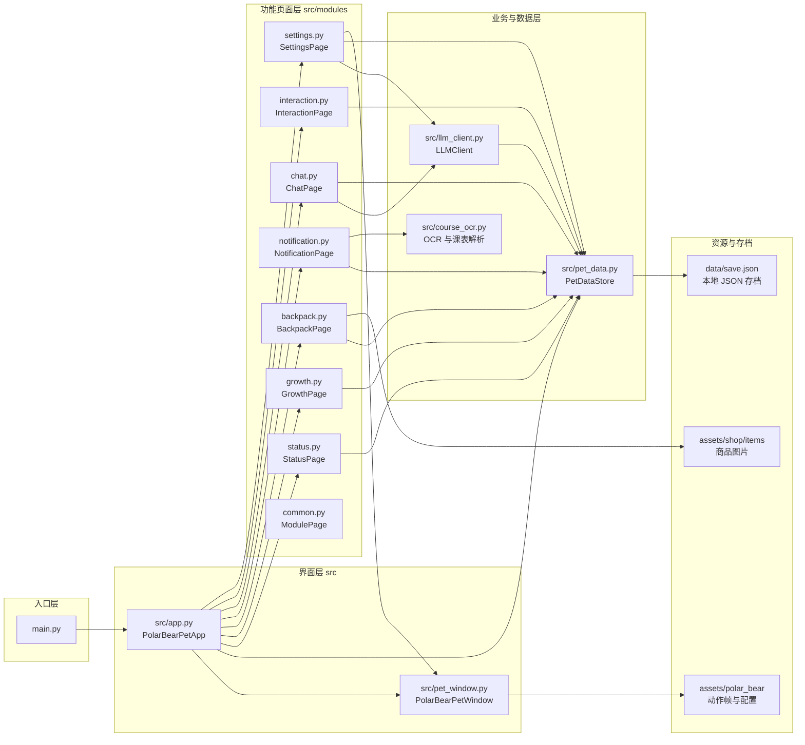
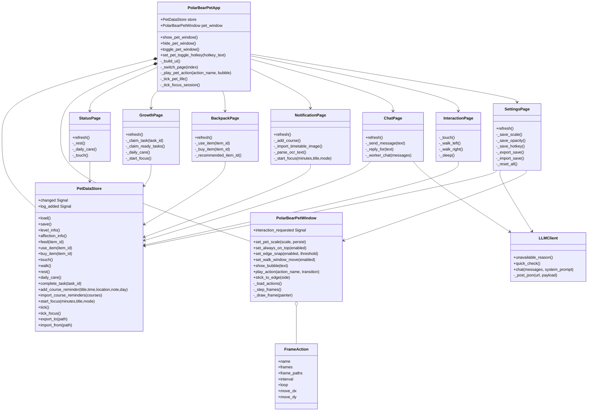
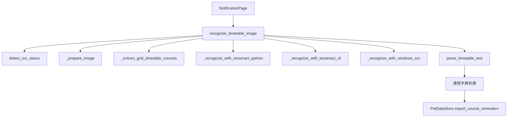
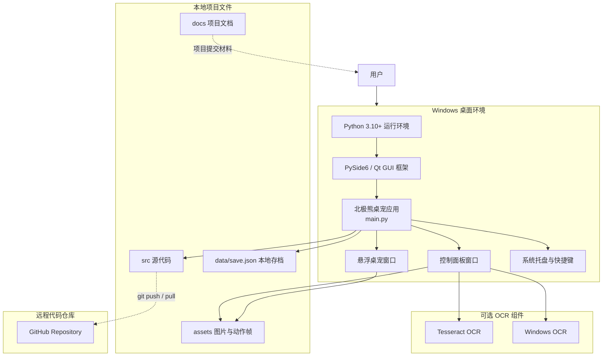

# 北极熊桌宠系统设计文档

## 1. 文档说明

本文档面向“北极熊桌宠项目”的系统设计提交，内容包括系统功能模块结构图、包图、类图、接口说明、数据表设计和系统部署图。项目采用 Python + PySide6 开发，主要运行在 Windows 桌面环境中，通过悬浮桌宠窗口、控制面板、本地 JSON 存档和图片序列帧资源实现桌面宠物的展示、交互、养成和提醒功能。

## 2. 系统总体设计

系统采用单机桌面应用架构，核心由三部分组成：

- 展示层：主控制面板、悬浮桌宠窗口、各功能模块页面。
- 业务层：状态成长、独立等级系统、背包投喂、任务奖励、课程提醒、大模型聊天互动、设置管理、动作控制。
- 数据层：本地 `data/save.json` 存档、动作资源配置、商品和任务常量配置。

系统入口为 `main.py`，启动后创建 PySide6 应用实例，并加载 `src/app.py` 中的 `PolarBearPetApp` 主窗口。主窗口统一管理 `PetDataStore` 数据中心和 `PolarBearPetWindow` 桌宠窗口，各业务页面通过共享的数据中心读写状态。

## 3. 系统功能模块结构图

```mermaid
flowchart TD
    A[北极熊桌宠系统] --> B[桌宠形象与桌面交互模块]
    A --> C[宠物状态与成长任务模块]
    A --> D[背包商店与喂养模块]
    A --> E[课程提醒与通知日志模块]
    A --> F[聊天互动模块]
    A --> G[系统设置与存档管理模块]
    A --> H[成长等级中心模块]

    B --> B1[真实 PNG 序列帧播放]
    B --> B2[单击互动]
    B --> B3[双击挥手]
    B --> B4[拖拽移动]
    B --> B5[贴边吸附]
    B --> B6[缩放与右键菜单]

    C --> C1[饱食度]
    C --> C2[心情值]
    C --> C3[体力值]
    C --> C4[好感度]
    C --> C5[状态变化记录]
    C --> C6[困难每日任务]

    D --> D1[商品展示]
    D --> D2[购买物品]
    D --> D3[使用物品]
    D --> D4[智能推荐]
    D --> D5[物品 Buff]

    E --> E1[课程列表]
    E --> E2[下一节课提醒]
    E --> E3[课表图片 OCR]
    E --> E4[专注计时]
    E --> E5[操作日志]

    F --> F1[快捷对话]
    F --> F2[状态回应]
    F --> F3[气泡反馈]
    F --> F4[多服务商大模型]
    F --> F5[本地兜底回复]

    G --> G1[透明度设置]
    G --> G2[置顶设置]
    G --> G3[桌宠缩放]
    G --> G4[快捷键设置]
    G --> G5[导入导出存档]

    H --> H1[等级称号]
    H --> H2[经验进度]
    H --> H3[好感上限]
    H --> H4[每日好感额度]
    H --> H5[成长路线]
    H --> H6[成长任务奖励]
```



## 4. 包图和文件模块结构

### 4.1 文件模块结构

```text
polar-bear-desktop-pet/
├─ main.py                         应用入口
├─ requirements.txt                运行依赖
├─ src/
│  ├─ app.py                       主控制台、系统托盘、全局快捷键、页面调度
│  ├─ pet_window.py                悬浮桌宠窗口、动作播放、拖拽、贴边吸附
│  ├─ pet_data.py                  数据中心、状态成长、背包、任务、课程、存档
│  ├─ llm_client.py                大模型供应商配置、OpenAI 兼容调用、角色提示词
│  ├─ course_ocr.py                课表图片 OCR 和文本解析
│  └─ modules/
│     ├─ status.py                 宠物状态与成长任务页面
│     ├─ growth.py                 独立成长等级中心页面
│     ├─ backpack.py               背包商店与喂养页面
│     ├─ notification.py           课程提醒、OCR、专注和日志页面
│     ├─ chat.py                   聊天互动页面
│     ├─ interaction.py            动作管理页面
│     ├─ settings.py               系统设置与存档页面
│     └─ common.py                 通用模块页面组件
├─ assets/
│  ├─ polar_bear/                  北极熊图片、动作帧和动作配置
│  └─ shop/items/                  背包商店物品图片
├─ data/
│  └─ save.json                    本地运行存档，已被 .gitignore 忽略
└─ docs/                           项目文档和 UML 图
```

### 4.2 包图



## 5. 类图

### 5.1 核心类关系图



### 5.2 OCR 相关类与函数关系



## 6. 类接口说明

### 6.1 `PolarBearPetApp`

| 接口 | 说明 |
|---|---|
| `show_pet_window()` | 显示悬浮桌宠窗口，并恢复到合理屏幕位置。 |
| `hide_pet_window()` | 隐藏悬浮桌宠窗口。 |
| `toggle_pet_window()` | 根据当前状态显示或隐藏桌宠。 |
| `set_pet_toggle_hotkey(hotkey_text)` | 保存并注册显示/隐藏桌宠的快捷键。 |
| `_play_pet_action(action_name, bubble)` | 播放指定桌宠动作，并可显示气泡文本。 |
| `_tick_pet_life()` | 定时触发状态衰减、陪伴时长累计和自动投喂逻辑。 |
| `_tick_focus_session()` | 定时刷新专注计时状态，完成后发放奖励。 |
| `_feed_from_tray()` | 从系统托盘快速投喂。 |
| `_rest_from_tray()` | 从系统托盘快速安排休息。 |

### 6.2 `PolarBearPetWindow`

| 接口 | 说明 |
|---|---|
| `play_action(action_name, transition=True)` | 播放指定动作，例如待机、走路、睡觉、挥手、贴边等。 |
| `show_bubble(text)` | 在桌宠旁显示气泡提示。 |
| `set_pet_scale(scale, persist)` | 设置桌宠显示比例，可选择是否持久化。 |
| `set_always_on_top(enabled)` | 设置桌宠窗口是否置顶。 |
| `set_edge_snap(enabled, threshold)` | 设置是否启用贴边吸附及吸附阈值。 |
| `stick_to_edge(side)` | 将桌宠吸附到左侧或右侧屏幕边缘，并切换扒墙动作。 |
| `fit_position_to_visible_screen()` | 修正桌宠位置，避免拖出屏幕。 |
| `interaction_requested` | PySide6 信号，向主窗口通知用户触发的交互动作。 |

### 6.3 `PetDataStore`

| 接口 | 说明 |
|---|---|
| `load()` / `save()` | 读取和保存本地 JSON 存档。 |
| `level_info()` | 返回等级、称号、好感上限、下一阶段等信息。 |
| `affection_info()` | 返回当前好感阶段、距离下一阶段的差值和说明。 |
| `feed(item_id)` | 投喂食物，扣减库存并更新状态。 |
| `use_item(item_id)` | 使用背包物品，支持食物、玩具和礼物。 |
| `buy_item(item_id)` | 使用金币购买商品并加入库存。 |
| `touch()` | 记录温柔互动，提升心情但不直接增加好感。 |
| `walk()` | 记录散步，消耗体力并提升心情。 |
| `rest()` | 安排休息，恢复体力。 |
| `daily_care()` | 完整关怀逻辑，满足条件后提升状态和好感。 |
| `complete_task(task_id)` | 检查任务达成条件，发放金币和经验。 |
| `tick()` | 状态自然衰减、Buff 生效、陪伴任务判断、自动投喂。 |
| `start_focus()` / `tick_focus()` | 专注计时开始、刷新和奖励结算。 |
| `add_course_reminder()` | 新增课程提醒。 |
| `import_course_reminders()` | 批量导入课程提醒。 |
| `export_to(path)` / `import_from(path)` | 导出或导入存档。 |

### 6.4 页面类接口

| 类 | 主要接口 | 说明 |
|---|---|---|
| `StatusPage` | `refresh()` | 刷新状态条、等级档案、好感档案和每日任务。 |
| `GrowthPage` | `refresh()`、`_claim_task()`、`_claim_ready_tasks()` | 独立展示等级、经验、好感上限、每日额度、成长路线和成长任务奖励。 |
| `BackpackPage` | `refresh()`、`_use_item()`、`_buy_item()` | 展示商品、投喂、购买、智能推荐。 |
| `NotificationPage` | `refresh()`、`_import_timetable_image()`、`_start_focus()` | 课程提醒、OCR 导入、专注计时和日志展示。 |
| `ChatPage` | `refresh()`、`_send_message()`、`_worker_chat()` | 聊天互动、联网大模型回复、本地兜底回复和状态反馈。 |
| `InteractionPage` | `_touch()`、`_walk_left()`、`_walk_right()`、`_sleep()` | 动作管理与动作触发。 |
| `SettingsPage` | `refresh()`、`_save_hotkey()`、`_export_save()`、`_import_save()` | 系统设置、快捷键、存档导入导出。 |

### 6.5 大模型服务接口

| 类 | 主要接口 | 说明 |
|---|---|---|
| `LLMClient` | `unavailable_reason()` | 判断大模型是否启用、服务商、模型、API 地址和 API Key 是否完整。 |
| `LLMClient` | `quick_check()` | 发送短测试消息，检查当前服务商连接是否可用。 |
| `LLMClient` | `chat(messages, system_prompt)` | 通过 OpenAI 兼容 `/chat/completions` 接口生成回复。 |
| `build_pet_system_prompt()` | 函数 | 根据状态、成长、课程、任务和日志构造北极熊桌宠角色提示词。 |

## 7. 数据表设计

本项目当前采用本地 JSON 文件 `data/save.json` 保存用户数据，没有使用关系型数据库。为满足设计文档中的“数据表设计”要求，以下按逻辑表方式描述 JSON 存档结构和常量配置结构。如果后续迁移到 SQLite 或 MySQL，可以直接按这些表创建数据库。

### 7.1 `pet_stats` 宠物状态表

| 字段名 | 类型 | 说明 |
|---|---|---|
| `hunger` | int | 饱食度，范围 0-100。 |
| `mood` | int | 心情值，范围 0-100。 |
| `energy` | int | 体力值，范围 0-100。 |
| `affection` | int | 好感度，受等级上限和每日上限限制。 |
| `level` | int | 当前等级。 |
| `exp` | int | 当前等级内经验值。 |
| `coins` | int | 冰原金币数量。 |

### 7.2 `inventory` 背包库存表

| 字段名 | 类型 | 说明 |
|---|---|---|
| `item_id` | string | 物品编号，例如 `fish`、`milk`、`berry_cake`。 |
| `count` | int | 当前持有数量。 |

### 7.3 `item_catalog` 商品配置表

| 字段名 | 类型 | 说明 |
|---|---|---|
| `item_id` | string | 商品编号。 |
| `name` | string | 商品名称。 |
| `type` | string | 商品类型，例如 `food`、`toy`、`gift`。 |
| `price` | int | 商品价格。 |
| `effects` | object | 对饱食度、心情、体力、好感等状态的影响。 |
| `image` | string | 商品图片路径。 |
| `buff` | object/null | 可选增益效果，例如定时产币、暂停饱食下降。 |
| `description` | string | 商品描述。 |

### 7.4 `task_catalog` 任务配置表

| 字段名 | 类型 | 说明 |
|---|---|---|
| `task_id` | string | 任务编号。 |
| `title` | string | 任务名称。 |
| `reward` | int | 完成后金币奖励。 |
| `exp` | int | 完成后经验奖励。 |
| `requirement.type` | string | 条件类型，例如登录、次数、陪伴分钟、状态阈值。 |
| `requirement.key` | string | 统计字段，例如 `feed`、`touch`、`focus_minutes`。 |
| `requirement.target` | int | 达成目标值。 |

### 7.5 `daily_tasks` 每日任务完成表

| 字段名 | 类型 | 说明 |
|---|---|---|
| `task_id` | string | 任务编号。 |
| `done` | bool | 当天是否已领取奖励。 |
| `today` | string | 当前任务日期，格式为 `YYYY-MM-DD`。 |

### 7.6 `daily_counts` 每日行为统计表

| 字段名 | 类型 | 说明 |
|---|---|---|
| `touch` | int | 温柔互动次数。 |
| `feed` | int | 投喂次数。 |
| `walk` | int | 散步次数。 |
| `rest` | int | 休息次数。 |
| `focus` | int | 专注完成次数。 |
| `focus_minutes` | int | 专注累计分钟数。 |
| `care` | int | 完整关怀完成次数。 |
| `affection_gain` | int | 当日已获得好感点数。 |
| `bond_breakthrough` | int | 当日好感阶段突破次数。 |

### 7.7 `settings` 系统设置表

| 字段名 | 类型 | 说明 |
|---|---|---|
| `opacity` | float | 桌宠透明度。 |
| `always_on_top` | bool | 是否置顶。 |
| `auto_feed` | bool | 是否启用自动投喂。 |
| `bubble_on` | bool | 是否显示气泡提示。 |
| `status_decay` | bool | 是否启用状态自然衰减。 |
| `edge_snap_enabled` | bool | 是否启用贴边吸附。 |
| `edge_snap_threshold` | int | 贴边吸附距离阈值。 |
| `pet_toggle_hotkey` | string | 显示/隐藏桌宠快捷键。 |
| `companion_goal_minutes` | int | 每日陪伴任务目标分钟数。 |
| `pat_multi_click_talk_threshold` | int | 连续点击触发反馈阈值。 |
| `llm` | object | AI 大模型配置，包含服务商、模型、API 地址、API Key 和启用状态。 |

### 7.8 `llm_config` 大模型配置表

| 字段名 | 类型 | 说明 |
|---|---|---|
| `enabled` | bool | 是否启用联网大模型聊天。 |
| `provider` | string | 服务商编号，例如 `deepseek`、`openai`、`zhipu`、`dashscope`。 |
| `model` | string | 模型名称，可由用户手动编辑。 |
| `api_url` | string | OpenAI 兼容接口基础地址。 |
| `api_key` | string | 用户配置的 API Key，本地保存。 |
| `auto_talk` | bool | 是否允许桌宠主动使用大模型生成轻量陪伴语。 |
| `temperature` | float | 模型回复随机性参数。 |
| `max_tokens` | int | 单次回复最大 token 数。 |

### 7.9 `course_reminders` 课程提醒表

| 字段名 | 类型 | 说明 |
|---|---|---|
| `title` | string | 课程或提醒标题。 |
| `time` | string | 上课或提醒时间。 |
| `location` | string | 地点。 |
| `note` | string | 备注。 |
| `day` | string | 星期或每天。 |
| `source` | string | 来源，例如手动、OCR、默认。 |

### 7.9 `focus_session` 专注计时表

| 字段名 | 类型 | 说明 |
|---|---|---|
| `active` | bool | 是否有专注计时正在运行。 |
| `paused` | bool | 是否暂停。 |
| `mode` | string | 计时类型，`focus` 或 `break`。 |
| `title` | string | 专注标题。 |
| `total_seconds` | int | 总秒数。 |
| `remaining_seconds` | int | 剩余秒数。 |
| `ends_at` | int | 预计结束时间戳。 |

### 7.10 `active_buffs` 当前增益表

| 字段名 | 类型 | 说明 |
|---|---|---|
| `item_id` | string | 触发 Buff 的物品编号。 |
| `name` | string | Buff 名称。 |
| `effect` | string | Buff 类型，例如 `coin`、`hunger_stop`、`mood_guard`。 |
| `value` | int | 单次效果值。 |
| `interval` | int | 生效间隔秒数。 |
| `expires_at` | int | 过期时间戳。 |
| `next_tick_at` | int | 下一次生效时间戳。 |
| `description` | string | Buff 描述。 |

### 7.11 `chat_history` 聊天记录表

| 字段名 | 类型 | 说明 |
|---|---|---|
| `role` | string | 消息角色，`user` 或 `bear`。 |
| `text` | string | 消息文本。 |
| `time` | string | 发送时间。 |

### 7.12 `logs` 操作日志表

| 字段名 | 类型 | 说明 |
|---|---|---|
| `id` | int | 日志序号，JSON 中用列表顺序表示。 |
| `time` | string | 日志时间。 |
| `category` | string | 日志类别，例如系统、投喂、互动、任务。 |
| `message` | string | 日志内容。 |

### 7.13 `growth` 成长记录表

| 字段名 | 类型 | 说明 |
|---|---|---|
| `affection_rewards` | list | 已领取过的好感阶段奖励标记，避免重复领取。 |

## 8. 系统部署图



## 9. 运行与部署流程

1. 安装 Python 3.10 或更高版本。
2. 在项目根目录执行 `pip install -r requirements.txt` 安装依赖。
3. 执行 `python main.py` 启动项目。
4. 应用启动后加载 `assets` 动作资源和 `data/save.json` 本地存档。
5. 用户通过控制面板、桌宠窗口、系统托盘或快捷键进行操作。
6. 状态变化、任务进度、课程提醒、设置项会实时保存到本地 JSON 存档。
7. 如需课表图片识别，可安装 Tesseract OCR 或使用 Windows OCR 作为可选组件。

## 10. 设计特点

- 采用单机桌面架构，不依赖后端服务器，部署简单。
- 数据中心 `PetDataStore` 统一管理业务数据，降低页面之间的数据耦合。
- 悬浮桌宠窗口与主控制台分离，既能独立显示桌宠，又能通过控制台管理状态。
- 使用真实 PNG 序列帧动作资源，提升桌宠动作表现力。
- 使用本地 JSON 存档，便于导入导出和调试。
- 课程提醒、OCR、专注计时、背包商店和成长任务形成完整陪伴闭环。
